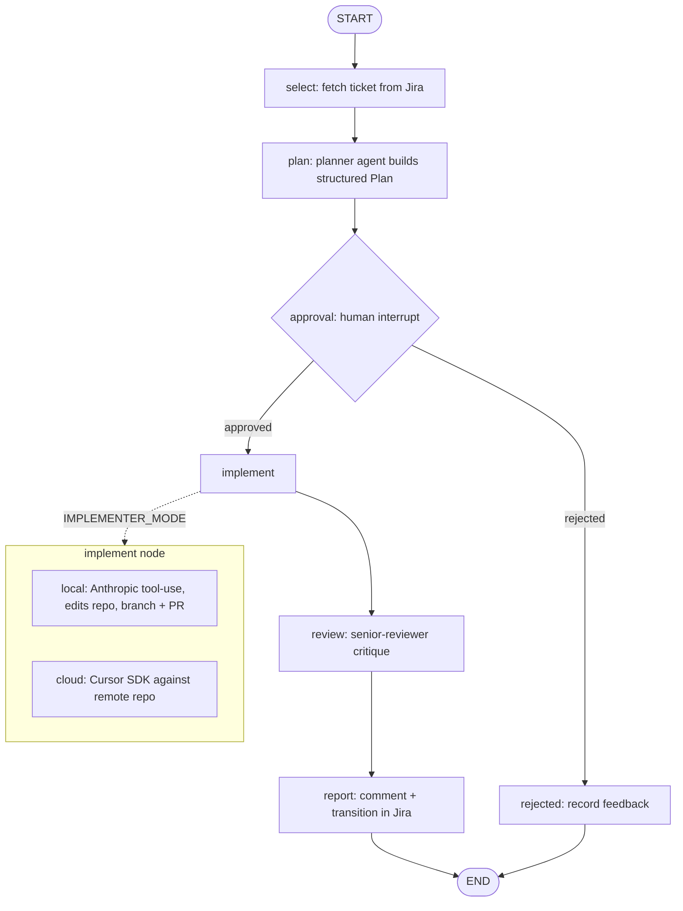
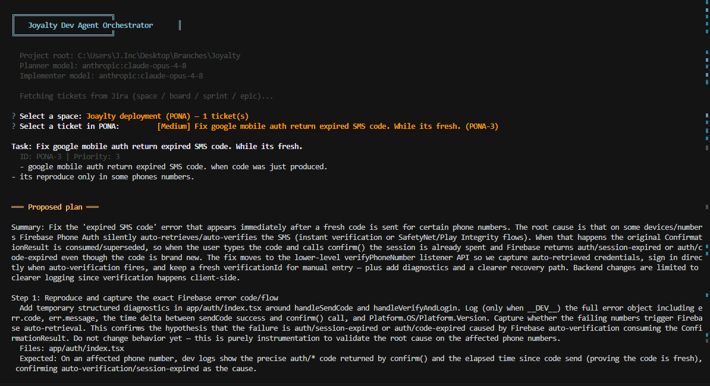
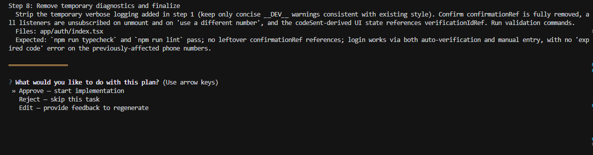

# myjira — Jira-driven coding agent

An agent that browses your Jira tickets, drafts an implementation **plan**,
waits for **human approval**, then **implements**, **reviews**, and **reports**
the result back to the ticket. It runs as an interactive CLI on top of a
[LangGraph](https://github.com/langchain-ai/langgraph) orchestrator and talks to
Jira through the Atlassian MCP server.

---

## Table of contents

- [How it works](#how-it-works)
- [The flow](#the-flow)
- [Project layout](#project-layout)
- [Configuration](#configuration)
- [Running it](#running-it)
- [Screenshots](#screenshots)
- [Roadmap](#roadmap)

---

## How it works

The CLI is just the presentation layer. The real flow lives in a graph
(`agents/graph/graph.py`) with six nodes:

- **select** — pull the chosen ticket from Jira (`select_ticket`).
- **plan** — the planner agent (`agents/agents/planner.py`) reads project
  context and emits a structured, step-by-step `Plan`.
- **approval** — the graph *pauses* on a human `interrupt`; the CLI renders the
  plan and collects approve / reject / edit.
- **implement** — runs either the **local** agent (Anthropic tool-use loop that
  edits this repo, branches, commits, opens a PR) or the **cloud** agent (Cursor
  SDK against a remote target repo).
- **review** — a senior-reviewer model critiques the implementation against the
  plan and acceptance criteria.
- **report** — posts a comment back to the Jira ticket and transitions it (e.g.
  to *In Review*).

A rejected plan skips straight to a `rejected` node that records the feedback on
the ticket.

## The flow



Selection is interactive: the browser walks the
`space -> board -> sprint/backlog -> epic -> ticket` hierarchy (with a flat-list
fallback). Each ticket runs through the graph one at a time; approval blocks
until you respond.

## Creating tickets

You can also create new Jira tickets without leaving the CLI. Both the space
browser and the flat list expose a **"+ Create a new ticket"** entry, and
`--create` jumps straight into the flow. The prompt collects a project key
(defaults to `JIRA_PROJECT_KEY`), summary, issue type, description, priority,
labels, and an optional parent epic, then creates the issue through the
Atlassian MCP `jira_create_issue` tool. After it's created you can plan and
implement it immediately, or go back to browsing.

## Project layout

```
main.py            -> thin entrypoint: sys.path bootstrap, arg parsing, hand off
agents/runner.py   -> drives the graph (invoke/interrupt/resume) + ticket browser
agents/graph/      -> the orchestrator graph + Jira (MCP) integration + config
agents/agents/     -> planner / implementer / cloud_implementer / fixer
agents/tools/      -> file + shell + git tools
agents/ui/cli.py   -> prompts & styled output primitives
```

## Configuration

Set these in a `.env` file (see `agents/config.example.py` and
`agents/graph/config.py` for the full list):

- **Models (provider-agnostic)**: the planner, implementer, fixer, reviewer, and
  Jira agent all run through LangChain, so each role takes a `"provider:model"`
  string. Set `PLANNER_MODEL` and `IMPLEMENTER_MODEL` to choose the model and
  provider, e.g. `anthropic:claude-opus-4-8`, `openai:gpt-4o`, or
  `google_genai:gemini-1.5-pro` (defaults to Anthropic).
- **Provider API keys**: set the key for whichever providers your models use —
  `ANTHROPIC_API_KEY`, `OPENAI_API_KEY`, and/or `GOOGLE_API_KEY`. Keys are read
  from the environment automatically; only the providers you reference are
  required at startup.
- **Jira / Atlassian (MCP)**: `JIRA_URL`, `JIRA_USERNAME`, `JIRA_API_TOKEN`,
  optional `JIRA_PROJECT_KEY`, `SPRINT_JQL`, `GROUPED_ISSUE_JQL`.
- **Implementer mode**: `IMPLEMENTER_MODE=local` (default) or `cloud`.
- **Cloud implementer (Cursor SDK)**: `CURSOR_API_KEY`, `CURSOR_MODEL`,
  `TARGET_REPO`, optional `TARGET_REPO_REF`.

> Note: `agents/config.py` currently hardcodes the local `project_root` that the
> local implementer edits — point it at the repo you want the agent to work on.

## Running it

```bash
# Interactive: browse Jira and pick a ticket
python main.py

# Create a new ticket (then optionally plan/implement it)
python main.py --create

# Run a specific ticket
python main.py --task PROJ-123

# Plan only, no implementation
python main.py --task PROJ-123 --dry-run

# Skip git branch/commit/PR operations
python main.py --task PROJ-123 --skip-git
```

## Screenshots

> Drop images into `docs/screenshots/` and they will render below.

**Ticket browser (space / board / sprint / epic / ticket):**



**Proposed plan + approval gate:**



**Implementation + outcome (PR link, review notes, Jira update):**


## Roadmap

### Web UI (planned)

A browser front-end over the same graph: pick tickets, watch the plan stream,
approve/reject from the page, and follow implementation + review live.

> Mockup / screenshot slot — add the design here once available.


### Run each ticket in its own terminal (planned)

Spawn the plan/implement lifecycle for a selected ticket in a **new OS
terminal** so the browser stays free and each ticket gets an isolated, watchable
window. Design and trade-offs (including local-mode git contention) are captured
in the saved plan:
[`.cursor/plans/spawn_ticket_in_terminal_c2bb78fe.plan.md`](.cursor/plans/spawn_ticket_in_terminal_c2bb78fe.plan.md).
